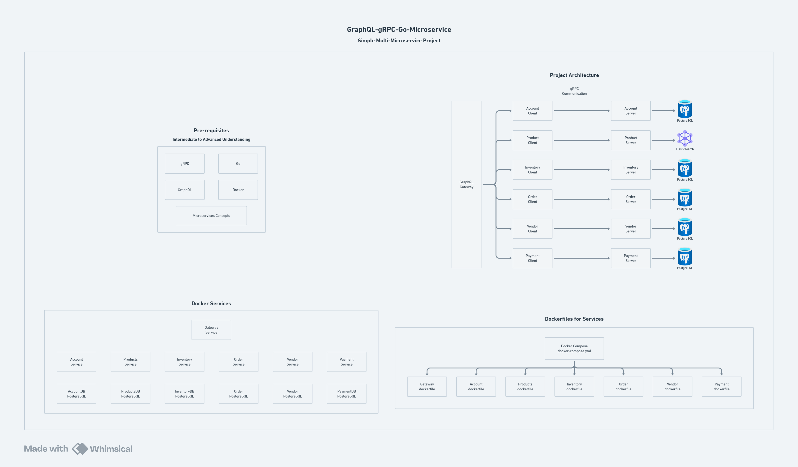

# GraphQL-gRPC-Go-Microservice-Project

A modern, scalable order management system built with microservices architecture, combining the flexibility of GraphQL with the performance of gRPC.

## Table of Contents

- [Architecture Overview](#architecture)
- [Key Features](#features)
- [Technology Stack](#tech-stack)
- [Getting Started](#getting-started)
  - [Prerequisites](#prerequisites)
  - [Installation](#installation)
  - [Running the Project](#running)
- [API Documentation](#api)
- [Contributing](#contributing)
- [LICENSE](#license)

## Architecture

[<-- Back to Table of Contents](#table-of-contents)



The system follows a microservices architecture with the following key components:

- **Gateway Service**: Acts as the single entry point, providing a unified GraphQL API
- **Account Service**: Manages user accounts and authentication
- **Product Service**: Handles product catalog and inventory
- **Inter-service Communication**: Implemented using gRPC for efficient service-to-service communication

[View detailed architecture diagram](https://whimsical.com/graphql-grpc-go-microservice-JGUJXyUsLacNEHpCCxCpcC)

## Features

[<-- Back to Table of Contents](#table-of-contents)

- **GraphQL API Gateway**: Single endpoint for all client operations
- **High Performance**: gRPC-based inter-service communication
- **Scalable Architecture**: Independent microservices with separate databases
- **Type Safety**: Strong typing with Protocol Buffers
- **Monitoring**: Built-in observability with Kibana and Pgadmin
- **Developer Experience**: GraphQL Playground for API exploration

## Tech Stack

[<-- Back to Table of Contents](#table-of-contents)

### Core Technologies

- **Backend**: Go 1.21+
- **API Gateway**: GraphQL
- **Service Communication**: gRPC
- **Interface Definition**: Protocol Buffers 3

### Databases

- **Account Service**: PostgreSQL 16
- **Product Service**: Elasticsearch 7.17.24

### Development Tools

- **Container Runtime**: Docker & Docker Compose
- **Database Management**:
  - Pgadmin 4 (PostgreSQL)
  - Kibana 7.17.24 (Elasticsearch)
- **API Development**: GraphQL Playground

## Getting Started

[<-- Back to Table of Contents](#table-of-contents)

### Prerequisites

1. Install Go 1.21 or later
2. Install Docker and Docker Compose
3. Install Make (optional, for using Makefile commands)

### Installation

```bash
# Clone the repository
git clone https://github.com/datarohit/GraphQL-gRPC-Go-Microservice-Project.git
cd GraphQL-gRPC-Go-Microservice-Project

# Install dependencies
go mod download
```

### Running

[<-- Back to Table of Contents](#table-of-contents)

```bash
# Start all services using Docker Compose
docker-compose up -d

# Or use make command if available
make docker-up
```

#### Service Endpoints

- GraphQL API: `http://localhost:8080/graphql`
- GraphQL Playground: `http://localhost:8080/playground`
- Pgadmin: `http://localhost:5050`
- Kibana: `http://localhost:5601`

## API

[<-- Back to Table of Contents](#table-of-contents)

### Postman API Testing

[](https://god.gw.postman.com/run-collection/32864979-78a66d62-d213-47d7-9123-7aa66b574ef7?action=collection%2Ffork&source=rip_markdown&collection-url=entityId%3D32864979-78a66d62-d213-47d7-9123-7aa66b574ef7%26entityType%3Dcollection%26workspaceId%3D1dd56a9a-12eb-40b3-b293-78395b3c2bc7)

### GraphQL Schema

The GraphQL schema is available in the following locations:

- Account Service: [account/readme.md](./account/readme.md)
- Product Service: [product/readme.md](./product/readme.md)

## Contributing

[<-- Back to Table of Contents](#table-of-contents)

1. Fork the repository
2. Create a feature branch:

   ```bash
   git checkout -b feature/your-feature-name
   ```

3. Commit your changes:

   ```bash
   git commit -am 'Add some feature'
   ```

4. Push to the branch:

   ```bash
   git push origin feature/your-feature-name
   ```

5. Submit a Pull Request

## License

[<-- Back to Table of Contents](#table-of-contents)

This project is licensed under the MIT License - see the [LICENSE](LICENSE) file for details.
